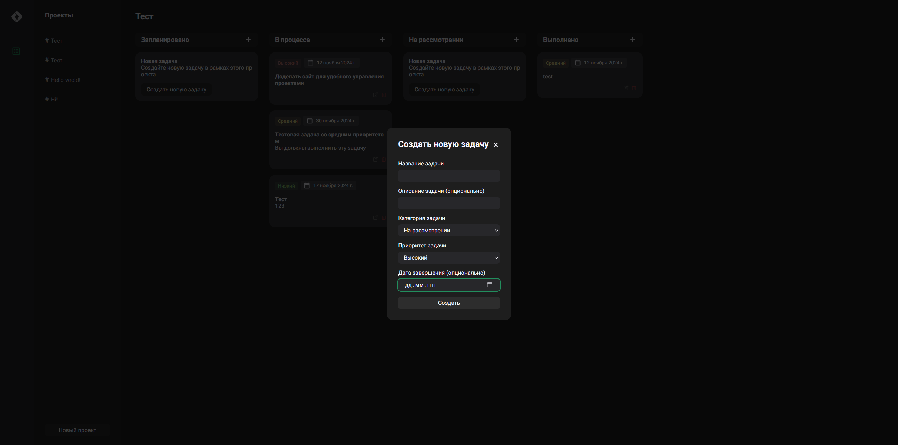

## Project Management

## Setup

1. Install PHP 8.0+
2. Set MySQL creds to /api/config.php file
3. Run server

## API

**prefix: /api**

**API doesn't have authorization!**

### Projects

- GET /projects/index.php

  Get list of all projects

- GET /projects/index.php?id=$ID

  Get info about project with given ID

- POST /projects/index.php

  Create a new project

- PUT /projects/index.php?id=$ID

  Edit all project fields

- DELETE /projects/index.php?id=$ID

  Delete a project with given ID

#### Tasks

- GET /projects/tasks/index.php

  Get list of all tasks

- GET /projects/tasks/index.php?id=$ID

  Get task with given ID

- GET /projects/tasks/index.php?project_id=$ID

  Get tasks by project ID

- POST /projects/tasks/index.php?project_id=$ID

  Create a new task for project with given ID

- PUT /projects/tasks/index.php?id=$ID

  Edit all task fields

- DELETE /projects/tasks/index.php?id=$ID

  Delete a task with given ID
